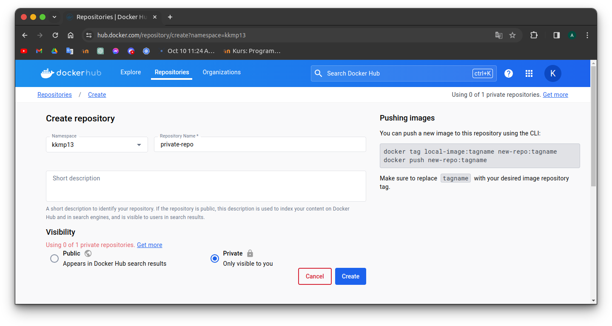
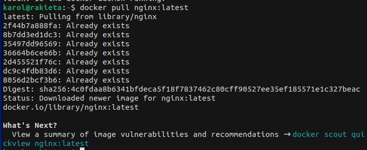
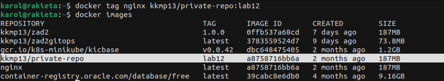
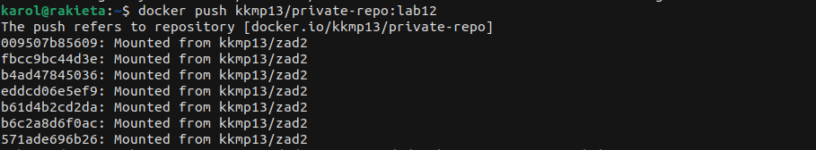
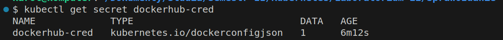
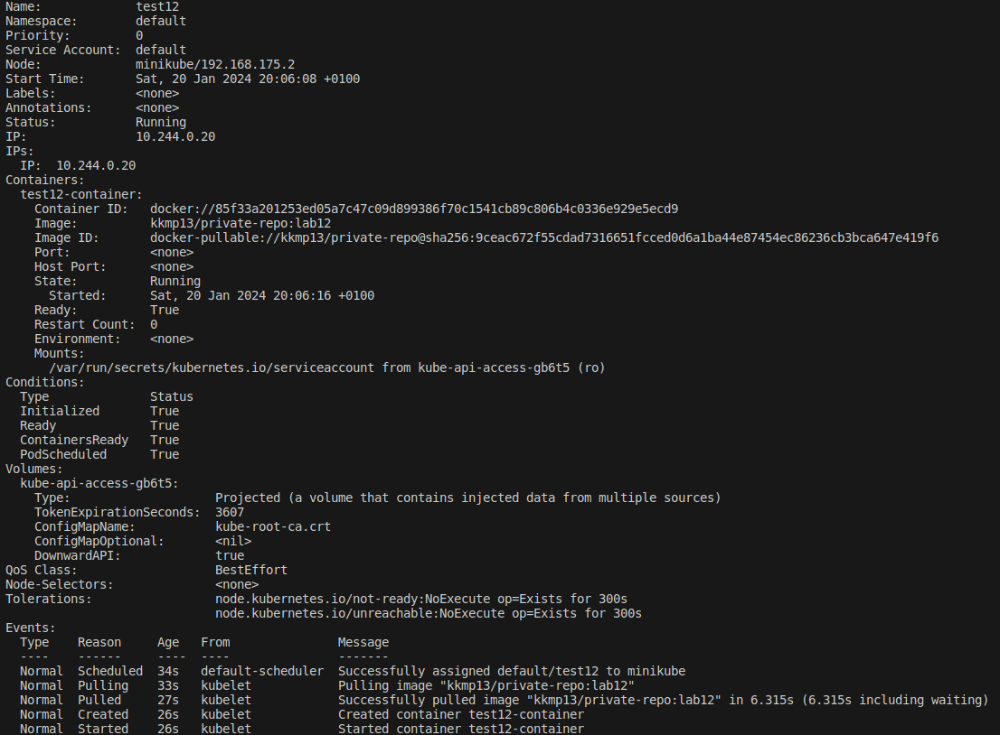
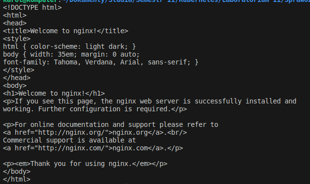

# Laboratorium 12 - sprawozdanie

## Krok 1.
Zadanie rozpocząłem od utworzenia nowego prywatnego repozytorium na osobistym koncie DockerHub pod nazwą *private-repo*:  



## Krok 2.
Następnie pobrałem obraz Nginx w najnowszej wersji za pomocą następującego polecenia:  

```
docker pull nginx:latest
```

Wynik działania polecenia:  



W dalszej części przypisałem nową nazwę wraz z tagiem (*kkmp13/private-repo:lab12*) dla pobranego obrazu:

```
docker tag nginx kkmp13/private-repo:lab12
```


Wynik działania polecenia:  


Tak przygotowany obraz przesłałem do utworzonego prywatnego repozytorium:

```
docker push kkmp13/private-repo:lab12
```

Wynik działania polecenia:  


## Krok 3.
W dalszej kolejności utworzyłem obiekt Kubernetes typu Secret o nazwie *dockerhub-cred*, zawierający wymagane poświadczenia, które umożliwiają dostęp do prywatnego repozytorium DockerHub - tj. nazwę użytkownika, hasło oraz adres e-mail. Dokonałem tego (podając prawidłowe dane) przy użyciu następującej komendy:

```
kubectl create secret docker-registry dockerhub-cred --docker-username=kkmp13 --docker-password=haslo-do-konta --docker-email=adres-email-do-konta
```

W wyniku działania polecenia został utworzony obiekt Secret, którego poprawność zweryfikowałem stosując następujące polecenia:

```
kubectl get secret dockerhub-cred
kubectl get secret dockerhub-cred --output="jsonpath={.data.\.dockerconfigjson}" | base64 --decode
```

Wynik działania polecenia:  


Kolejnym krokiem było zdefiniowanie manifestu pod nazwą [test12-pod.yaml](link). Plik umożliwia utworzenie poda o nazwie *test12* w domyślnej przestrzeni nazw. Wskazałem nazwę utworzonego obrazu (*kkmp13/private-repo:lab12*), a następnie, zgodnie z dokumentacją, użyłem pola *imagePullSecrets* w sekcji specyfikacji. Pole to umożliwiło mi powiązanie  obiektu Secret o nazwie *dockerhub-cred* z tworzonym podem, w celu uwierzytelnienia przy pobieraniu wskazanego obrazu, pochodzącego z prywatnego repozytorium.


## Krok 4. 
Utworzony plik *test12-pod.yaml* zastosowałem poleceniem:

```
kubectl apply -f test12-pod.yaml
```

Aby potwierdzić, że utworzony pod *test12* działa poprawnie i wykorzystuje właściwy obraz, wydałem następujące polecenie:

```
kubectl describe pod test12
```

Wynik działania polecenia:


Jak łatwo zauważyć pod został utworzony na podstawie odpowiedniego obrazu oraz poprawnie uruchomiony. W celu uzyskania całkowitej pewności poprawności działania poda, wydałem komendę:

```
kubectl exec -it test12 -- curl localhost
```

Wynik działania polecenia:  


Cel zadania został osiągnięty.